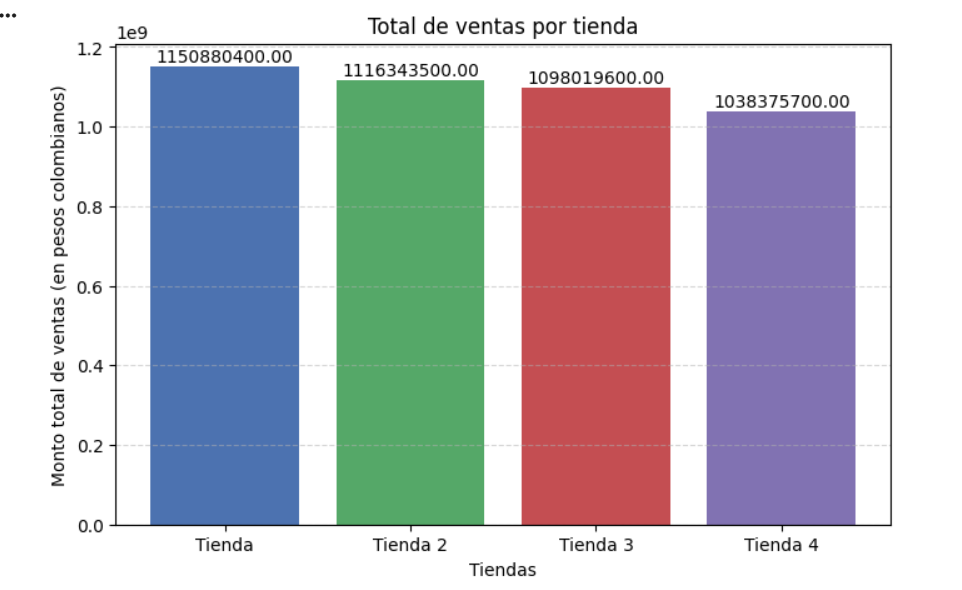

<h1>Problema de Juan</h1>

- Estado del proyecto: FINALIZADO

Este proyecto pretende analizar el desempeño que tienen cuatro tiendas administradas por el señor Juan en Colombia. La idea es identificar qué tienda tiene el menor rendimiento comercial. Esto permitirá que el sr. Juan tome una decisión bien informada sobre la tienda que debe vender.

El proyecto evalúa múltiples análisis de datos cuantitativos y visualizaciones que permitirán tener una mejor comprensión de los resultados.

A través de la siguiente visualización de gráficos, nos daremos cuenta de cómo se dan los números en cada tienda.

Análisis 1: FACTURACIÓN

Recomendación: Los datos muestran que es recomendable vender la Tienda 4, dado que es la tienda con menor rendimiento económico principalmente, además de ser uno de los que menos cobros por envío tiene y de manejar una pobre calificación por parte de los clientes. Esto la convierte en la candidata ideal para cerrarla y mejor invertir el capital en otros activos.
